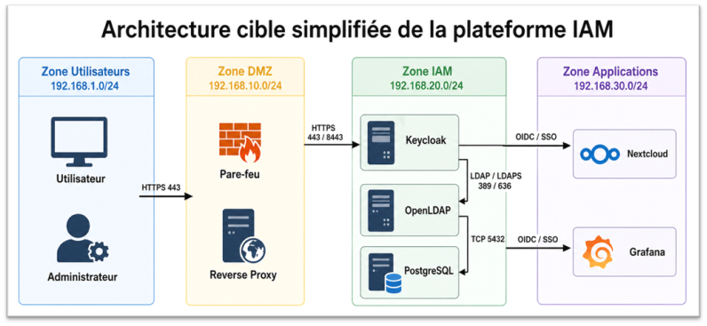

# Centralized Identity and Access Management Platform

## Overview

This project presents the design and deployment of a centralized Identity and Access Management (IAM) platform in a containerized laboratory environment.

The solution centralizes authentication and access control for multiple applications using Keycloak as the Identity Provider and OpenLDAP as the centralized user directory.

## Objectives

- Centralize user identity management
- Implement Single Sign-On (SSO)
- Integrate LDAP-based authentication
- Implement Multi-Factor Authentication (MFA)
- Implement Role-Based Access Control (RBAC)
- Integrate multiple applications with Keycloak
- Provide authentication event logging
- Deploy the platform using Docker and Docker Compose

## Architecture

The platform is composed of:

- **Keycloak** — Identity Provider and authentication server
- **OpenLDAP** — centralized user directory
- **PostgreSQL** — Keycloak database
- **MariaDB** — Nextcloud database
- **Nextcloud** — cloud collaboration platform
- **Grafana** — monitoring and visualization platform
- **Docker / Docker Compose** — containerized deployment environment

## Authentication Flow

1. The user accesses Nextcloud or Grafana.
2. The application redirects the user to Keycloak.
3. Keycloak authenticates the user against OpenLDAP.
4. Multi-Factor Authentication can be required using OTP.
5. Keycloak issues the required authentication tokens.
6. The user is redirected back to the application.
7. The application applies the user's assigned roles and permissions.

## Security Features

### Single Sign-On

Keycloak provides centralized authentication between the integrated applications.

### Multi-Factor Authentication

OTP-based MFA provides an additional authentication factor.

### Role-Based Access Control

Users are assigned roles that determine their permissions within the applications.

### LDAP Federation

Keycloak is connected to OpenLDAP to centralize user identities.

## Technologies

- Ubuntu Server
- Docker
- Docker Compose
- Keycloak
- OpenLDAP
- PostgreSQL
- MariaDB
- Nextcloud
- Grafana
- LDAP
- OpenID Connect (OIDC)
- SSO
- MFA / TOTP
- RBAC

## Testing

The following scenarios were tested:

- Docker services availability
- LDAP user federation
- Keycloak authentication
- MFA using OTP
- Nextcloud SSO
- Grafana SSO
- RBAC
- Authentication event logging

## Future Improvements

- HTTPS and TLS certificates
- Reverse proxy
- DMZ-based production architecture
- High availability for Keycloak and LDAP
- LDAP replication
- Integration with enterprise identity providers

Field: **Cloud, Security and Infrastructure**
